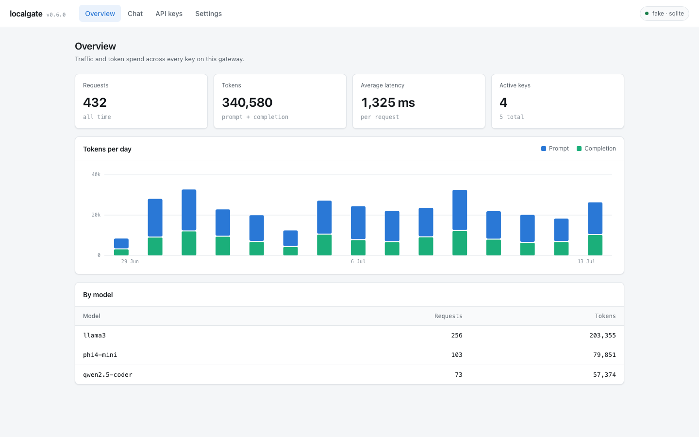
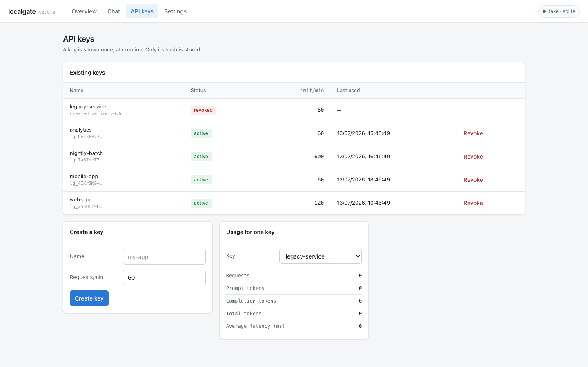

# localgate

**Turn any local LLM into a managed API — real API keys, token accounting, and RAG memory
that makes a small model remember far more than its context window holds.**

[](https://github.com/AnjalLLL/localgate/actions/workflows/ci.yml)
[](LICENSE)
[](https://www.python.org/downloads/)



<sub>The built-in dashboard at <code>/dashboard/</code> — token spend, latency, and per-model
usage across every key. Shown with sample data.</sub>

---

## Why

Ollama, LM Studio and LocalAI solve model *serving*. They deliberately don't solve anything
around it:

- **No API key management.** No per-user keys, no revocation, no usage tracking.
- **No memory past the context window.** Your 8K model forgets everything beyond 8K tokens.
- **No token accounting.** You guess at what you've spent.
- **No database story.** You wire up Postgres yourself.

localgate is the management layer. It sits between your app and your inference server and
adds all four — without touching how you serve models.

## Installation

localgate is [on PyPI](https://pypi.org/project/localgate/). Pick whichever of these you
already have — you don't need all three:

```bash
uv tool install localgate       # no Python/pip setup needed if you have uv
# or
pipx install localgate          # isolated install, doesn't need a venv
# or
pip install localgate           # into your current environment/venv
```

All three put a `localgate` command on your PATH. If `pip` or `pipx` say "command not
found": macOS doesn't ship them by default — `pip3` (from `python3 -m ensurepip` or
Homebrew's `python`) and `pipx` (`brew install pipx`) both need to be installed first. If
you don't already have Python tooling set up, `uv tool install` is the path of least
resistance: [install uv](https://docs.astral.sh/uv/getting-started/installation/) (one
command, no Python required first), then `uv tool install localgate`.

A container image is also published, at `ghcr.io/anjalllll/localgate`.

## Quick start

```bash
ollama serve                     # your inference backend
ollama pull llama3
ollama pull nomic-embed-text     # enables RAG memory

localgate init                   # set up config dir, generate admin key, run migrations
localgate keys create --name my-app      # prints your key, once
localgate serve
```

Developing localgate itself, instead of just using it:

```bash
git clone https://github.com/AnjalLLL/localgate.git && cd localgate
uv sync --all-extras
uv run localgate db upgrade
uv run localgate serve
```

Now use it like OpenAI, because it *is* the OpenAI API:

```python
from openai import OpenAI

client = OpenAI(base_url="http://localhost:8000/v1", api_key="lg_9f3a...")

response = client.chat.completions.create(
    model="llama3",
    messages=[{"role": "user", "content": "Hello!"}],
)
```

Full walkthrough: **[Getting Started](docs/getting-started.md)**.

## The memory bit

This is the part that isn't a proxy. Send an `X-Session-ID` and the gateway stores each
turn, embeds it, and retrieves what's relevant on later turns:

```python
client = OpenAI(
    base_url="http://localhost:8000/v1",
    api_key="lg_9f3a...",
    default_headers={"X-Session-ID": "conversation-1"},
)

client.chat.completions.create(
    model="llama3",
    messages=[{"role": "user", "content": "My name is Ana and I prefer Postgres."}],
)

# A separate request. No history sent. The model still knows.
client.chat.completions.create(
    model="llama3",
    messages=[{"role": "user", "content": "What database do I prefer?"}],
)
# → "You prefer Postgres."
```

The model answers correctly not because you sent the history, but because the gateway
retrieved it. Past a threshold, older turns are folded into a rolling summary, so the
context window holds the *useful* part of a long conversation rather than the most recent
part of it. See **[RAG Memory](docs/rag-memory.md)**.

## Features

- **OpenAI-compatible** — works with any OpenAI SDK, LangChain, or curl. Unknown fields are
  forwarded to the backend, so your sampling knobs keep working.
- **API key management** — create, revoke, and rate-limit per key. Hashed, never stored raw.
- **RAG memory** — automatic chunking, embedding, retrieval, and rolling summarization.
- **Token accounting** — prompt/completion tokens per key, per model, over time.
- **Any database** — SQLite with zero config; Postgres or Neon with one env var.
- **Any backend** — Ollama, vLLM, llama.cpp, or any OpenAI-compatible server. Third parties
  can add more via an entry point, no fork required.
- **Model aliasing** — map `fast` → `phi4-mini` and swap models without touching clients.
- **Prompt caching** — opt-in; identical prompts skip inference entirely.
- **Production-ready** — structured JSON logs with correlation IDs, Prometheus metrics,
  liveness/readiness split, graceful shutdown, fail-fast config validation.
- **Dashboard** — keys, usage and conversations in the browser, at `/dashboard/`.

## Dashboard

Served at `/dashboard/` — no build step, no separate deploy. It talks to the same `/admin`
API the CLI does, so anything it can do is equally scriptable.



Create and revoke keys, watch token spend per model, browse stored conversations with their
rolling summaries, and point the gateway at a new database — with the connection tested
before it is saved.

## CLI

```bash
localgate init                           # first-time setup: config dir, admin key, migrations
localgate doctor                         # diagnose your installation (paths, DB, perms)
localgate serve                          # start the gateway
localgate health                         # is the backend up? is the DB migrated?
localgate backends                       # what adapters are installed

localgate keys create --name my-app      # create a key (printed once)
localgate keys list                      # every key, active and revoked
localgate keys revoke <id>               # revoke (history is kept)
localgate keys update <id> --rate-limit N  # change a key's rate limit
localgate keys usage <id>                # token usage for one key

localgate db upgrade                     # apply migrations
localgate db current                     # current schema revision
localgate db set-url <url>               # test and save a new database URL

localgate login --url https://gw.example.com --api-key <key>   # connect to a remote gateway
localgate whoami                         # show your usage on the connected gateway

localgate code                           # interactive coding session in the current directory
localgate code "add a health check"      # one-off task, then exit
localgate code --remote                  # route inference through the logged-in gateway

localgate deploy --domain gw.example.com --target compose    # generate Caddyfile + docker-compose
localgate deploy --domain gw.example.com --target systemd    # generate Caddyfile + systemd unit
```

The CLI talks to the database (and, for `code`, the inference backend) directly, not to a
running server — because `keys create` has to work before you have a key, and `db upgrade`
has to work when the server won't start.

Shell completion: `localgate --install-completion` (bash/zsh/fish/PowerShell, via Typer).

## `localgate code`

A minimal coding agent that reads and edits files in the current project, backed by whatever
model `localgate` is already pointed at — no separate API key needed, since it talks to the
backend directly rather than through the gateway.

```bash
localgate code                                    # REPL — run /help once inside for the full list
localgate code "fix the off-by-one in parser.py"   # one-shot
localgate code "..." --auto-approve --auto-commit  # unattended, with every write committed
localgate code --plan                              # writes are queued and reviewed as a batch
```

- Every write is shown as a colored diff and asks for confirmation, unless `--auto-approve`.
- **Write modes** — manual (default), auto-accept (`--auto-approve`), and plan (`--plan`: writes
  are queued during the turn and applied as one all/none/pick-individually batch at the end).
  In a real terminal, **Shift+Tab cycles between the three live**; `/mode` is the same toggle
  for terminals where that key doesn't come through, or to set it non-interactively.
- On a dirty working tree, it warns once before writing anything (`--force` to skip).
- `--auto-commit` commits each turn's writes, tagged `localgate-agent:`. `/undo` reverts the last
  write (or the last agent commit, with `--auto-commit`) via git; `/rewind [n]` steps back
  through the last `n` writes directly (independent of `--auto-commit` — every write gets a
  checkpoint, not just committed ones).
- `/model` opens a picker (name, size, quantization); `/model <name>` switches directly, with a
  warning before a mid-session switch and a check for tool-calling support first.
- `/theme [dark|light|none]`, `--no-color`/`NO_COLOR`, and `/config` for persisted preferences
  (`~/.config/localgate/config.toml`: theme, default model, auto-approve, max-turns — precedence
  is flags > env vars > that file > built-in defaults).
- `/usage` (session token/request totals), `/context` (how full the conversation is vs. the
  model's context window), `/resume` (pick a past session for this project to continue), `/tools`
  (everything available this session, and what's off and why).
- Tools: `read_file`, `write_file`, `list_directory`, `search_files` (grep-like), `git_status`,
  `git_diff`. All confined to the project directory; `.gitignore` and `.localgateignore` keep
  secrets and generated directories out of the model's reach. No shell/`run_command` tool.
- **What decides when the agent searches, delegates, or writes?** The model does — there's no
  separate routing logic. Each tool's own description is the primary steering (e.g. `write_file`'s
  says to read a file first; `web_search`'s says to only use it for things not in the project or
  training data). `delegate_task`/`web_search` also get a couple of extra sentences appended to
  the system prompt, but only when that tool is actually enabled for the session — see
  `AgentSession.system_prompt()` in `agent/loop.py`. In **manual** write-mode (the default —
  `/mode`, shift+tab), a search or delegation asks for confirmation first, same as a write;
  auto/plan mode run both without asking.
- **Sub-agents** (`--allow-delegation`, off by default): the agent can hand off a self-contained
  sub-task to a fresh, isolated sub-agent and get back only its summary. Read-only tools unless
  the delegating call explicitly grants more; a sub-agent cannot itself delegate (depth 1). Test
  this against your own model before relying on it — a small local model may not reliably judge
  *when* delegating actually helps.
- **Web search** (opt-in, off unless `LOCALGATE_SEARCH_PROVIDER` is set — the tool doesn't exist
  at all otherwise, not just disabled). Two providers:
  - `openserp` (**recommended**) — a free, self-hosted, no-API-key search API
    ([karust/openserp](https://github.com/karust/openserp)): `docker run -p 127.0.0.1:7000:7000
    karust/openserp:latest serve -a 0.0.0.0 -p 7000`, then `LOCALGATE_SEARCH_PROVIDER=openserp`.
    Runs on your own machine, so this doesn't actually leave your network — the closest fit to
    localgate's local-first stance. Override the URL with `LOCALGATE_SEARCH_BASE_URL` if it's not
    on the default `http://localhost:7000`.
  - `tavily` — a hosted, paid API; needs `LOCALGATE_SEARCH_API_KEY` too. Kept for anyone who
    already has a key. This one genuinely sends query text to a third party.

  Either way, results are title + short snippet + URL, never full page content.
- **MCP servers** (config-driven, stdio only): list servers in
  `~/.config/localgate/mcp_servers.json` (`[{"name": "...", "command": "...", "args": [...]}]`)
  and their tools are connected at startup and offered to the model as `mcp__<server>__<tool>`.
  A server that fails to connect is skipped with a warning, not a reason to fail the whole
  session. `/mcp` in the REPL lists what's connected; `--no-mcp` skips connecting for one run.
- Conversation history and recalled context persist per project (`.localgate/session_id`),
  reusing the same RAG memory layer as the HTTP API — re-running it in a project you worked
  on before picks up where you left off. Disable with `--no-memory` or `LOCALGATE_MEMORY_ENABLED=false`.
- Exit codes for scripted/non-interactive use: `0` success, `2` bad usage, `3` hit `--max-turns`,
  `4` a write was declined, `5` the backend rejected the request, `6` the backend was
  unreachable, `130` interrupted.

Tool-calling quality depends entirely on the model — verify yours actually returns structured
tool calls (not JSON printed as text) before relying on this day to day.

## Self-hosting with automatic HTTPS

`localgate deploy` generates a Caddyfile (Caddy handles ACME/TLS automatically) and either a
Docker Compose file or a systemd unit, with a fresh admin key written to a 0600 env file:

```bash
localgate deploy --domain gw.example.com --target compose
# Copy the generated files to your server, then:
#   docker compose up -d

localgate deploy --domain gw.example.com --target systemd
# Follow the printed instructions to install the unit and Caddyfile.
```

By default only `/v1/*` and `/health*` are exposed. Pass `--expose-admin` to also expose the
dashboard and admin routes (add an IP allowlist to the Caddyfile before doing so).

Once the gateway is running, hand out keys and connect from any machine:

```bash
localgate keys create --name alice      # on the server
localgate login --url https://gw.example.com --api-key <key>   # on Alice's machine
localgate code --remote "refactor auth.py"    # runs inference on your gateway
```

## Documentation

| | |
|---|---|
| [Getting Started](docs/getting-started.md) | Zero to working gateway |
| [Configuration](docs/configuration.md) | Every setting |
| [API Reference](docs/api-reference.md) | Every endpoint |
| [Database Setup](docs/database-setup.md) | SQLite → Postgres → Neon |
| [RAG Memory](docs/rag-memory.md) | How memory works, and how to tune it |
| [Architecture](docs/architecture.md) | How it's built, and why |
| [Deployment](docs/deployment.md) | Running it somewhere real |
| [Decisions](docs/decisions/) | ADRs for the choices that shaped the codebase |

## Contributing

See [CONTRIBUTING.md](CONTRIBUTING.md). Adding a backend means writing one class. Issues
tagged `good-first-issue` are a good place to start.

## License

[MIT](LICENSE)

Give star if you like this project